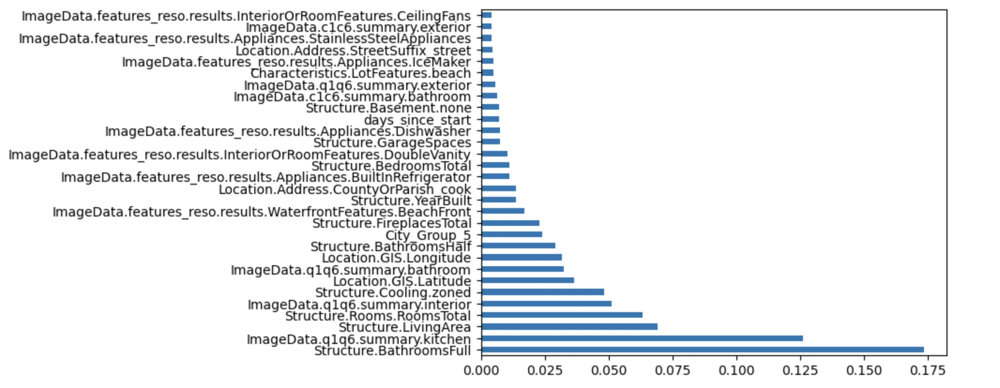

# Datathon24
Predict house prices in Ilinois

# File description
- Description.ipynb has the logging and the plots used for analysis and processing of the data
- preprocessing.ipynb has the working version of the data preprocessing
- model.ipynb contains the final model (the last one in the notebook) along with a some the others that were tested

# Process

## Preprocessing
Run the preprocessing notebook, which takes the `train.csv` file and processes it. This script creates multiple files, each representing different preprocessing stages. The final output is a version containing the most representative and treated features. It also handles the preprocessing for the test.csv since it has to follow the same rules. 

## Modelling

These are the algorithms we tried with grid search:
Linear regression
Random forest
Extra trees
XGB boost

## Feature Importance
Regretably, the most important plot of our data did not render properly in Description.ipynb, so we are appending it here. The following is the plot of feature importance:

